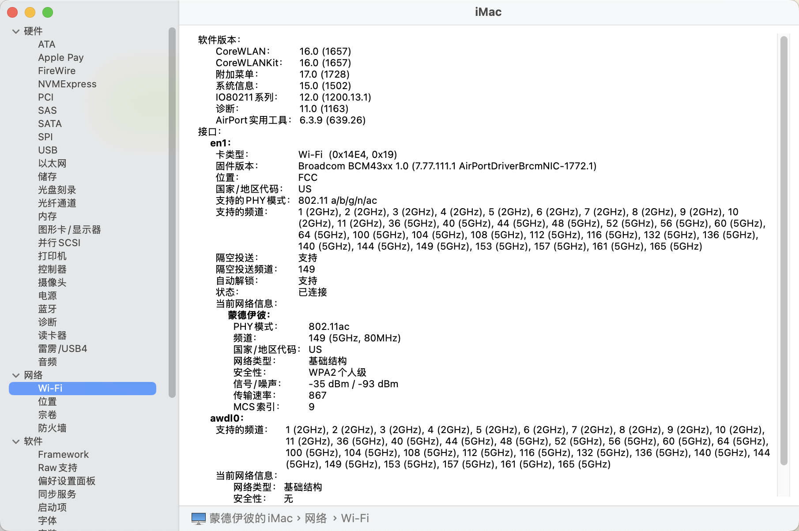
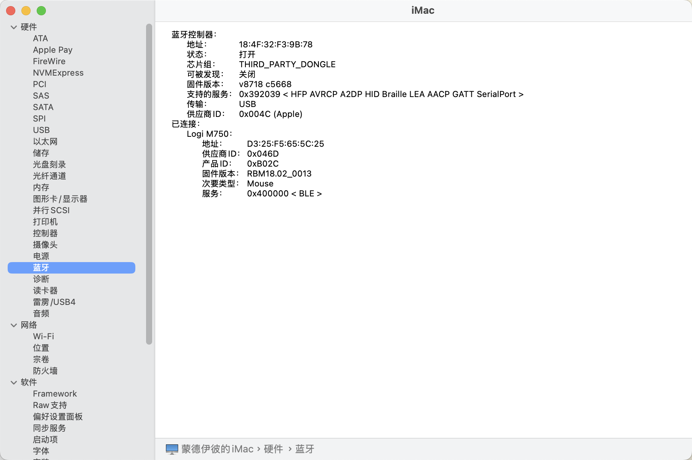

# macOS-10500-b460i
- opencore 1.0.1
- ventura 15.0.1

---
## 硬件
| 类别   | 型号                            |
| ------ | ------------------------------- |
| CPU    | i5-10500                        |
| 主板   | rog strix b460i gaming          |
| 内存   | 海盗船 lpx ddr4 3000hz 16GB x 2 |
| 硬盘   | WD SN580 1T                     |
| 显卡   | AMD RX6800xt                    |
| 网卡卡 | DW1560                          |
| 机箱   | 鱼巢G5MAX                       |
| 电源   | 利民TG850W                      |

## 正常功能
- CPU睿频
- usb端口映射（背板USB3.0x6， 前置USB3.0x1）
- 集成显卡驱动正常（dp输出正常，hdmi输出正常）
- 音频
- WIFI
- 蓝牙
- 睡眠

## 说明
- EFI_install - 安装系统时引导用
- EFI - 最终引导配置

## 用到的软件
- Rapidefi
- OpenCore Legacy Patcher
  - 解决DW1560无线和蓝牙问题
- OCAT
  - 编辑config.plist

## 截图
### WIFI

### 蓝牙

